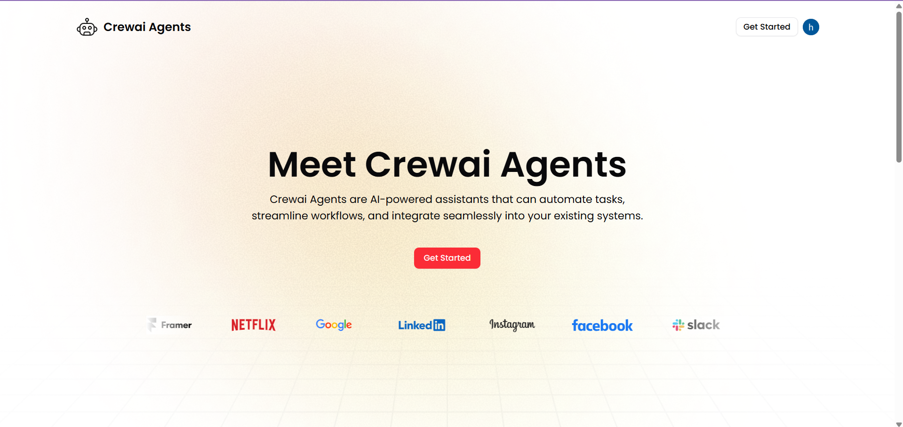
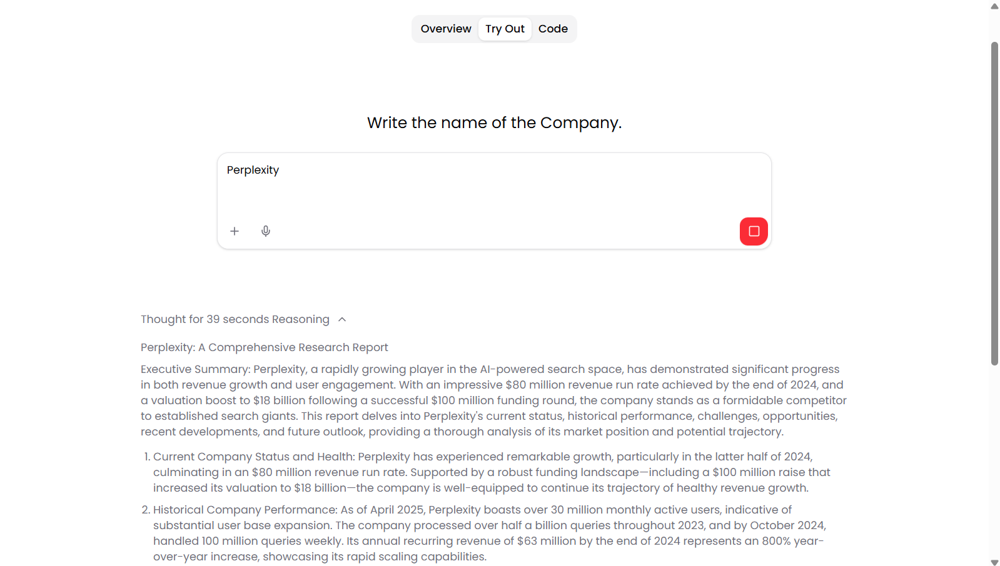
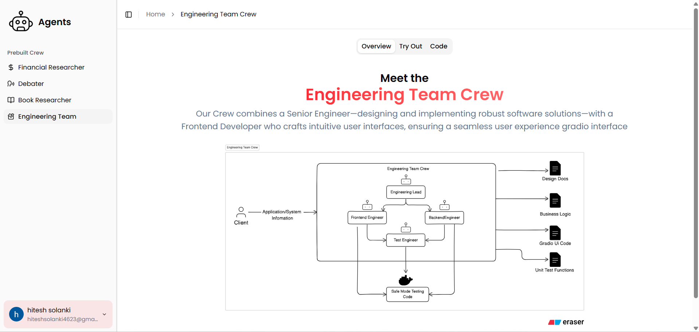
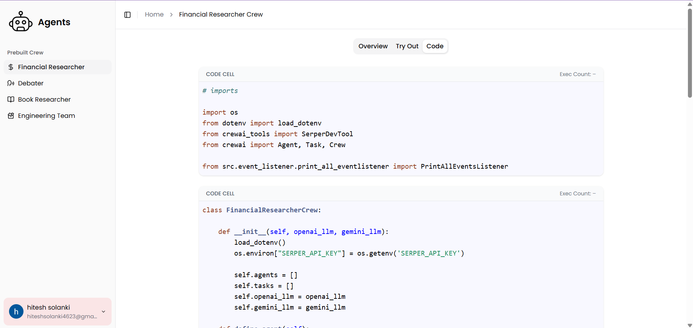
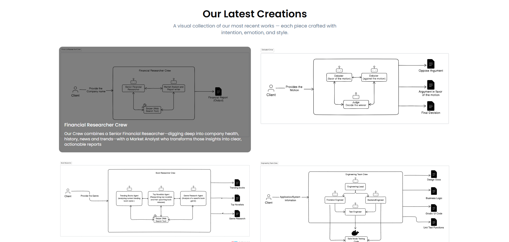

# 🤖 Crewai Example

Welcome to **Crewai Example** — a modular, AI-powered platform that uses agent collaboration to automate complex reasoning tasks. This project demonstrates the power of [CrewAI](https://github.com/joaomdmoura/crewAI) with real-time streaming, a clean FastAPI backend, and multi-model LLM support.

---

## 🚀 Features

- 🧠 **CrewAI Agent Orchestration**  
  Define specialized agents and crews to perform complex multi-step tasks through reasoning and collaboration.

- 🌐 **Streaming Event Output (SSE)**  
  Real-time feedback via **Server-Sent Events**, so users see the step-by-step thought process of the AI crew.

- ⚡ **FastAPI Backend**  
  Built with FastAPI for blazing fast RESTful APIs, parameterized streaming endpoints, and scalable integration.

- 🔍 **Serper Web Tool**  
  Crew agents use the **Serper.dev** search API to fetch real-time data from the web to enrich their decision-making.

- 🔁 **Multi-LLM Support (OpenAI & Gemini)**  
  Crew members can think and reason using **OpenAI** or **Gemini** models interchangeably.

---

## 🛠 Tech Stack

| Layer       | Technology               |
| ----------- | ------------------------ |
| Backend     | Python, FastAPI          |
| AI Engine   | CrewAI (multi-agent)     |
| Streaming   | Server-Sent Events (SSE) |
| Web Search  | Serper.dev API           |
| LLM Support | OpenAI, Gemini           |
| Frontend    | Next.js, Tailwind CSS    |

---

## 🧑‍💻 Prebuilt Crews

- **Financial Researcher**  
  Gathers real-time data about companies and generates reports.

- **Debater**  
  Engages in argumentation (propose vs oppose) and concludes a decision.

- **Book Researcher**  
  Identifies trending books, top novelists, and analyzes genres.

- **Engineering Team**  
  Converts software requirements into:  
  `Design Docs`, `Business Logic`, `Gradio UI Code`, and `Unit Tests`.

---

## 📷 Preview

### 🔍 Home

### 🧠 Try Out a Crew

### 💡 Agent Reasoning with SSE

### ⚙️ Code View

### 🧩 Visual Diagram of Crews

---
